# Sebenza Logistics Suite - Architectural Document

## Table of Contents
1. [High-Level Application Overview](#high-level-application-overview)
2. [Main Components](#main-components)
3. [Key Data Models](#key-data-models)
4. [Core Workflows](#core-workflows)
5. [Technology Stack](#technology-stack)
6. [System Architecture Diagrams](#system-architecture-diagrams)
7. [Data Flow Diagrams](#data-flow-diagrams)
8. [Component Interaction Diagrams](#component-interaction-diagrams)
9. [Security Considerations](#security-considerations)
10. [Future Enhancements](#future-enhancements)

## High-Level Application Overview

**Sebenza Logistics Suite** is a comprehensive, web-based SaaS platform designed for logistics and warehouse management operations. The application serves as an all-in-one business management solution that combines project management, financial accounting, inventory control, and human resources management into a unified platform.

### Purpose and Scope
- **Primary Purpose**: Streamline logistics operations through integrated project management, financial tracking, and inventory control
- **Target Users**: Logistics companies, warehouse operators, distribution centers, and supply chain managers
- **Business Value**: Centralized operations management, automated financial reporting, real-time inventory tracking, and enhanced collaboration

### Key Business Capabilities
- **Project & Task Management**: Track multiple warehouse/logistics projects with task assignments and progress monitoring
- **Financial Management**: Complete accounting suite with invoicing, payments, expenses, and financial reporting
- **Inventory Operations**: Stock management, warehouse operations, and transfer tracking
- **Human Resources**: Employee management, job postings, and departmental organization
- **Client Relations**: Customer management with integrated messaging and document handling
- **Compliance & Reporting**: Financial reports, analytics, and audit trails

## Main Components

### Frontend Architecture
The application follows a modern React-based architecture with Next.js 15 as the framework foundation.

#### Component Structure
```
src/
├── app/                     # Next.js App Router pages
│   ├── dashboard/           # Main dashboard
│   ├── projects/           # Project management
│   ├── accounting/         # Financial reports
│   ├── inventory/          # Stock management
│   ├── hr/                 # Human resources
│   └── [other modules]/    # Feature-specific pages
├── components/             # Reusable UI components
│   ├── ui/                 # Base UI primitives (Radix UI)
│   ├── layout/             # Navigation and layout
│   ├── accounting/         # Financial components
│   ├── inventory/          # Inventory components
│   └── [domain-specific]/  # Module-specific components
├── contexts/               # React Context providers
│   ├── auth-context.tsx    # Authentication state
│   └── data-context.tsx    # Global data management
└── lib/                    # Utilities and data models
    ├── data.ts             # TypeScript types and mock data
    └── utils.ts            # Utility functions
```

### Backend Architecture
Currently implemented as a client-side application with mock data, designed for easy transition to a full-stack architecture.

#### Data Layer
- **Current**: In-memory state management using React Context
- **Planned**: RESTful API with database persistence
- **Mock Data**: Comprehensive seed data for all business entities

### External Integrations
- **AI Processing**: Mock implementations for task status updates and late fee calculations
- **File Handling**: Document upload and management system
- **Authentication**: Mock authentication with role-based access control

## Key Data Models

### Core Business Entities

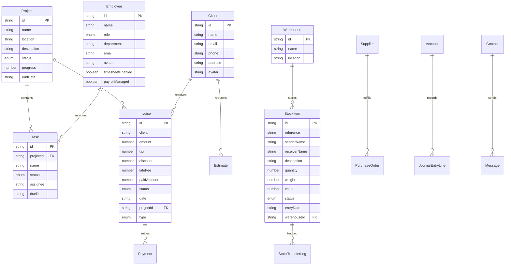

### Financial Data Models

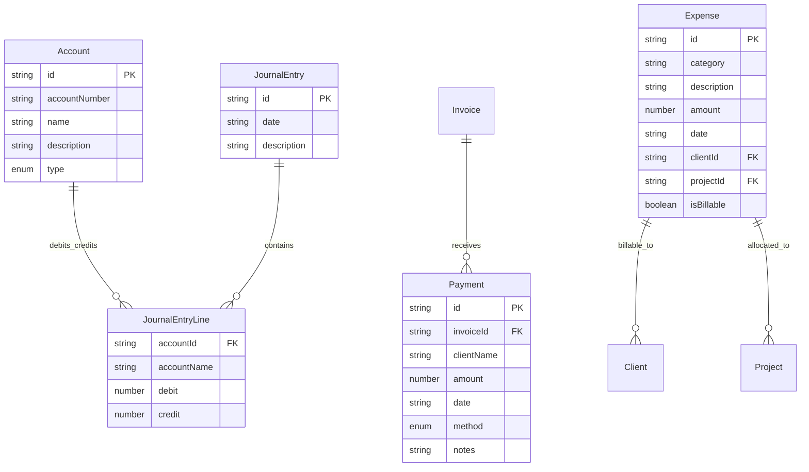

### Inventory & Logistics Models

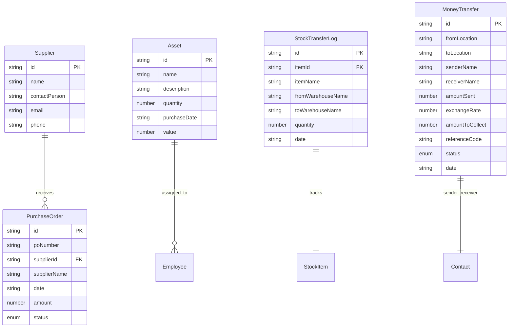

## Core Workflows

### 1. Project Management Workflow

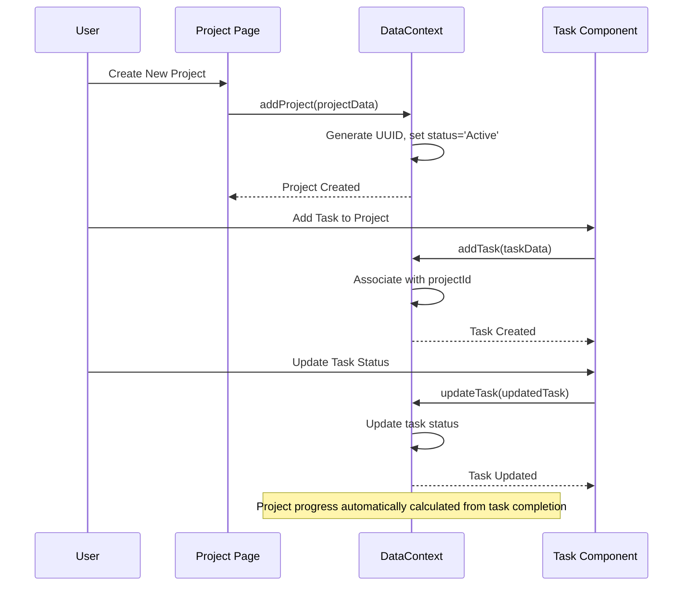

### 2. Financial Processing Workflow

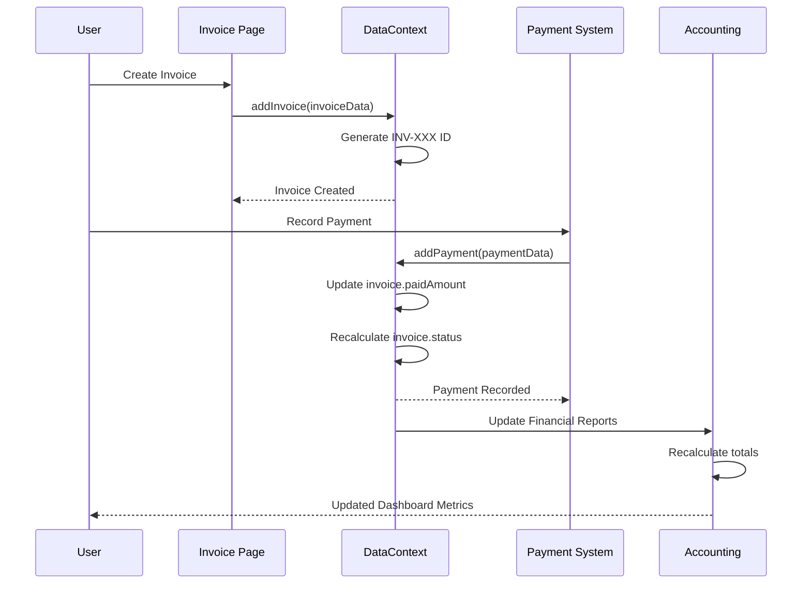

### 3. Inventory Management Workflow

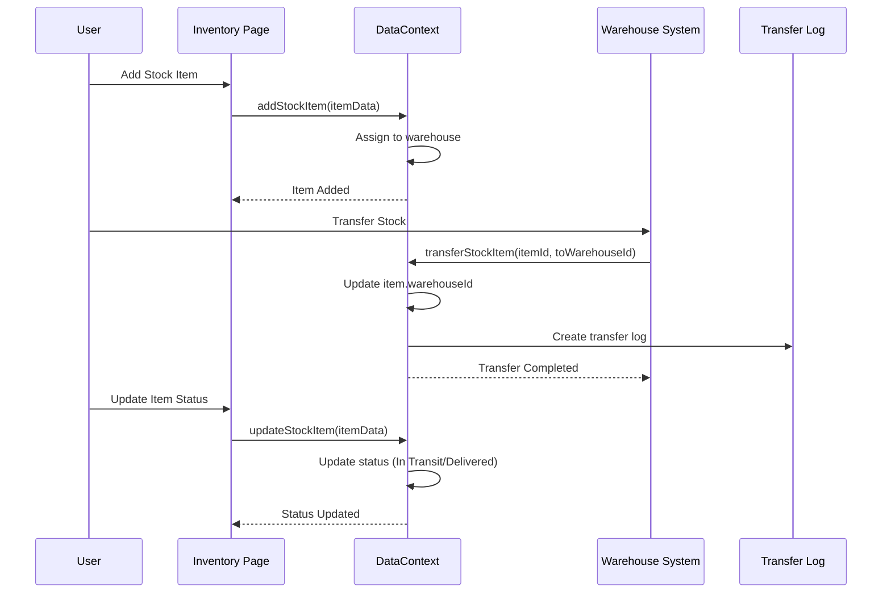

### 4. Authentication & Authorization Workflow

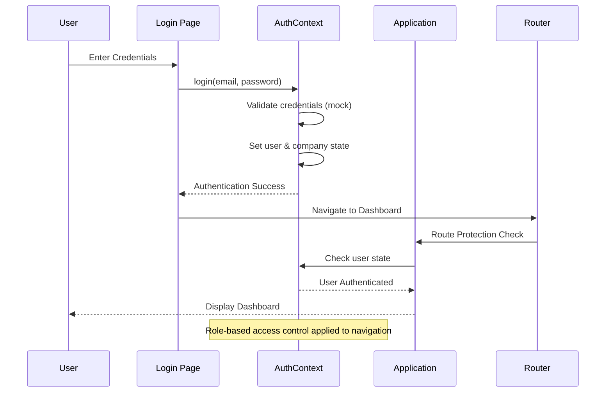

## Technology Stack

### Frontend Technologies
- **Framework**: Next.js 15.3.3 with App Router
- **Runtime**: React 18.3.1
- **Language**: TypeScript 5.x
- **Styling**: Tailwind CSS 3.4.1 with custom design system
- **UI Components**: Radix UI primitives with custom styling
- **Icons**: Lucide React (475+ icons)
- **Charts**: Recharts 2.15.1
- **Forms**: React Hook Form 7.54.2
- **Date Handling**: date-fns 3.6.0

### Development & Build Tools
- **Build Tool**: Turbopack (Next.js)
- **Package Manager**: npm
- **Code Quality**: TypeScript strict mode
- **Styling**: PostCSS with Tailwind
- **Development Server**: Next.js dev server

### State Management
- **Global State**: React Context API
- **Local State**: React useState/useReducer
- **Data Persistence**: In-memory (transitioning to database)

### Design System
- **Colors**: 
  - Primary: Professional blue (#6495ED)
  - Background: Light gray (#E0E0E0)
  - Accent: Soft green (#90EE90)
- **Typography**: Inter font family
- **Components**: Custom component library built on Radix UI
- **Responsive Design**: Mobile-first approach with Tailwind breakpoints

## System Architecture Diagrams

### High-Level System Architecture

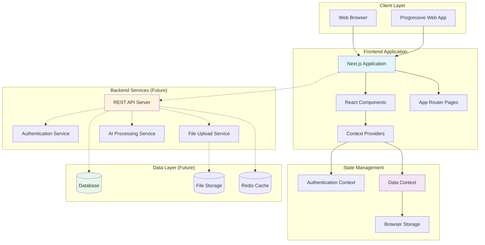

### Component Architecture

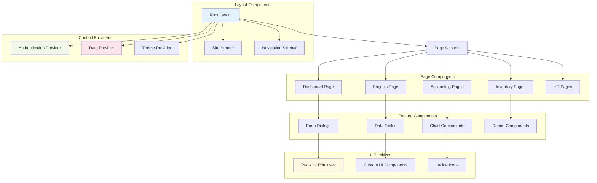

## Data Flow Diagrams

### User Interaction Data Flow

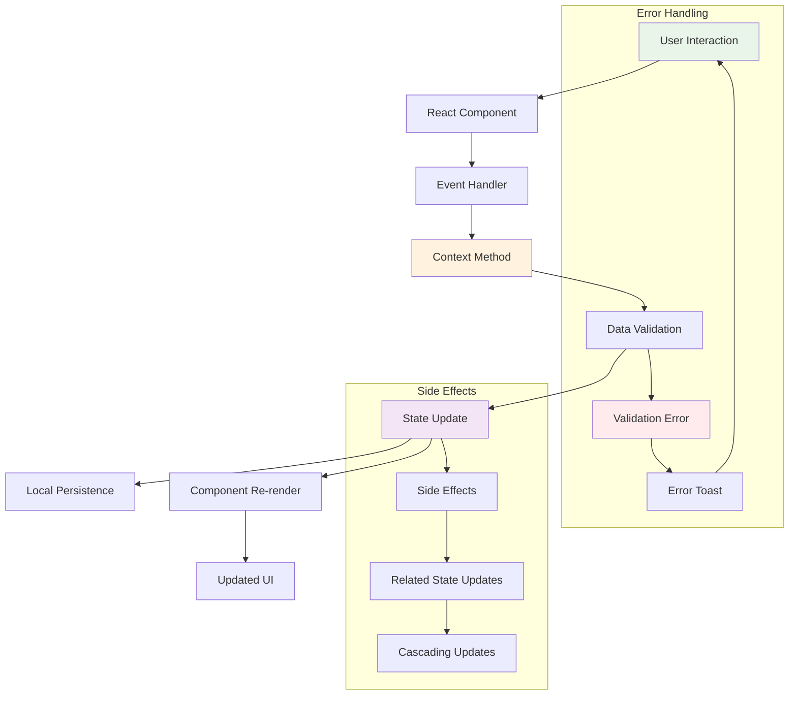

### Financial Data Flow

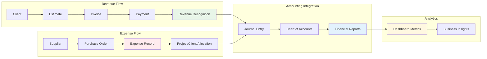

## Component Interaction Diagrams

### Authentication Flow

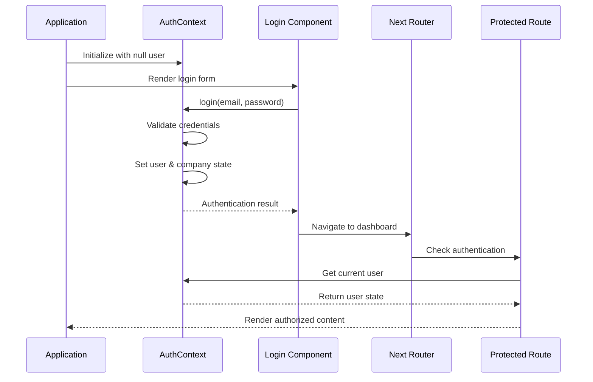

### Data Management Flow

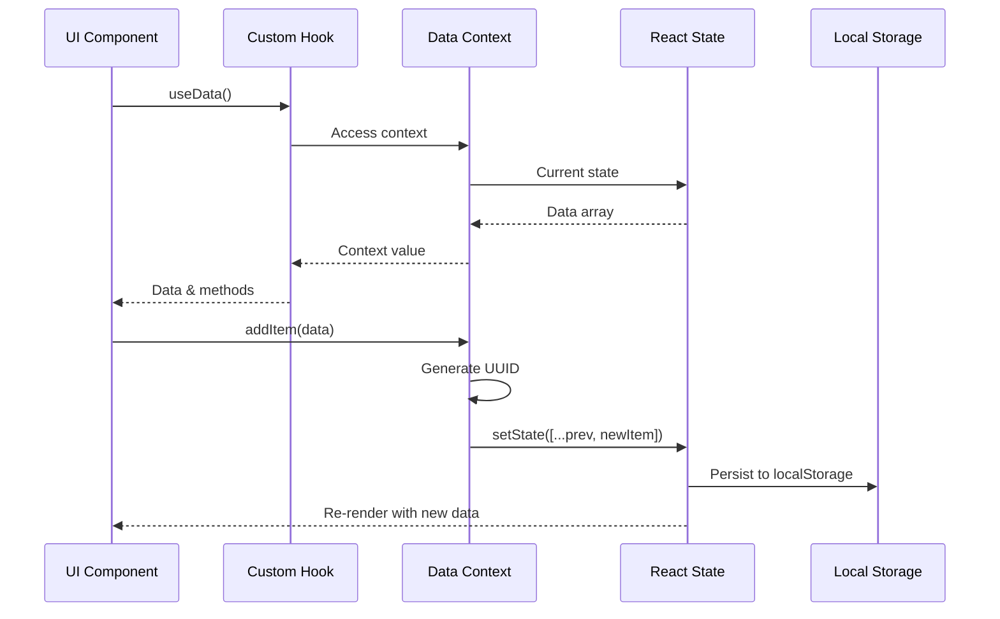

## Security Considerations

### Current Security Model (Mock Implementation)
- **Authentication**: Hardcoded credentials for demonstration
- **Authorization**: Role-based navigation (admin/user)
- **Data Protection**: Client-side only, no sensitive data exposure
- **Session Management**: In-memory state only

### Production Security Requirements
- **Authentication**: Multi-factor authentication with JWT tokens
- **Authorization**: Fine-grained role-based access control (RBAC)
- **Data Encryption**: HTTPS/TLS for data in transit, AES for data at rest
- **Input Validation**: Server-side validation for all inputs
- **API Security**: Rate limiting, CORS policies, request authentication
- **Audit Logging**: Comprehensive logging for all user actions
- **Data Privacy**: GDPR/CCPA compliance for customer data

### Security Architecture (Future)

```mermaid
graph TB
    subgraph "Client Security"
        CSP[Content Security Policy]
        HTTPS[HTTPS Enforcement]
        XSS[XSS Protection]
    end
    
    subgraph "API Security"
        JWT[JWT Authentication]
        RBAC[Role-Based Access Control]
        RateLimit[Rate Limiting]
        CORS[CORS Policy]
    end
    
    subgraph "Data Security"
        Encryption[Data Encryption]
        Backup[Secure Backups]
        Audit[Audit Logging]
    end
    
    subgraph "Infrastructure Security"
        WAF[Web Application Firewall]
        VPN[VPN Access]
        Monitoring[Security Monitoring]
    end
    
    Client[Client Application] --> CSP
    Client --> HTTPS
    Client --> XSS
    
    API[API Server] --> JWT
    API --> RBAC
    API --> RateLimit
    API --> CORS
    
    Database[(Database)] --> Encryption
    Database --> Backup
    Database --> Audit
    
    Infrastructure[Cloud Infrastructure] --> WAF
    Infrastructure --> VPN
    Infrastructure --> Monitoring
```

## Future Enhancements

### Technical Roadmap

#### Phase 1: Backend Integration
- **Database Implementation**: PostgreSQL with Prisma ORM
- **REST API Development**: Express.js or Fastify backend
- **Authentication Service**: Auth0 or custom JWT implementation
- **File Upload Service**: AWS S3 or Azure Blob Storage

#### Phase 2: Advanced Features
- **Real-time Updates**: WebSocket integration for live collaboration
- **Advanced Reporting**: Custom report builder with PDF generation
- **Mobile Application**: React Native mobile app
- **API Integration**: Third-party logistics and accounting system integrations

#### Phase 3: AI & Analytics
- **Machine Learning**: Predictive analytics for inventory and demand forecasting
- **Natural Language Processing**: Enhanced AI task management
- **Business Intelligence**: Advanced analytics dashboard with ML insights
- **Automation**: Workflow automation and intelligent process optimization

### Scalability Considerations

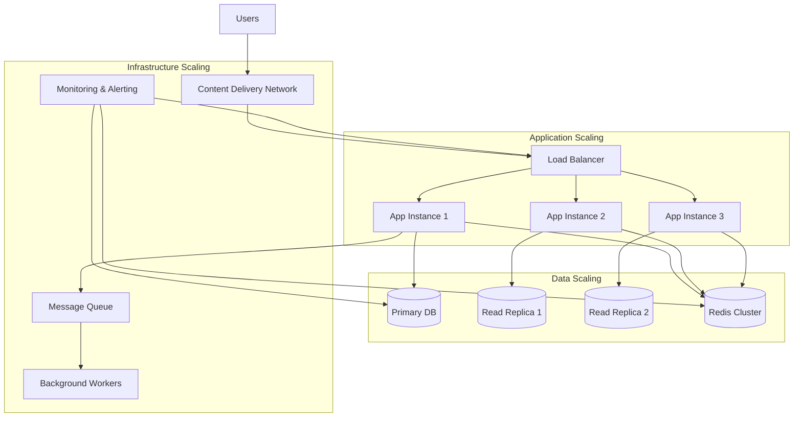

### Performance Optimization
- **Code Splitting**: Dynamic imports for route-based code splitting
- **Caching Strategy**: Browser caching, CDN, and Redis for API responses
- **Image Optimization**: Next.js Image component with WebP support
- **Bundle Optimization**: Tree shaking and dead code elimination
- **Database Optimization**: Query optimization and proper indexing strategies

---

**Document Version**: 1.0  
**Last Updated**: July 3, 2025  
**Author**: Senior Software Architect  
**Review Status**: Initial Draft

*This document provides a comprehensive overview of the Sebenza Logistics Suite architecture. It should be updated as the system evolves and new features are implemented.*
