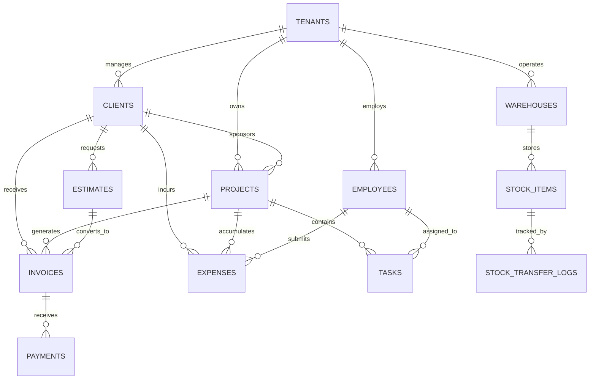
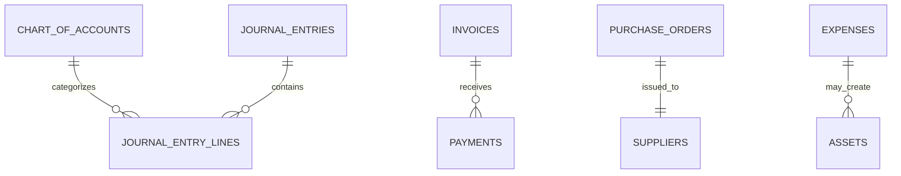
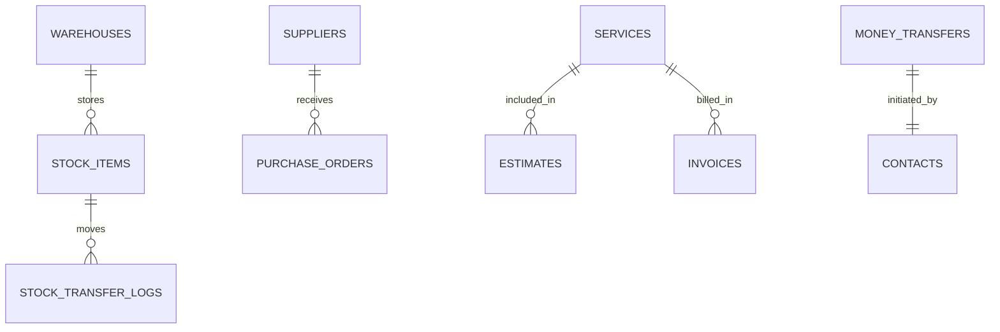

# Database Design Document

## Overview

This document outlines the database design for Sebenza Logistics, a comprehensive logistics and supply chain management SaaS application. The database supports multi-tenant operations, financial management, project tracking, inventory control, and operational workflows.

## Table of Contents

- [Overview](#overview)
- [Database Architecture](#database-architecture)
- [Entity Relationship Diagrams](#entity-relationship-diagrams)
- [Data Models](#data-models)
- [Relationships](#relationships)
- [Indexing Strategy](#indexing-strategy)
- [Data Integrity Constraints](#data-integrity-constraints)
- [Performance Considerations](#performance-considerations)
- [Security and Compliance](#security-and-compliance)
- [Backup and Recovery](#backup-and-recovery)
- [Migration Strategy](#migration-strategy)
- [Appendices](#appendices)

## Database Architecture

### Technology Stack

- **Database Engine**: PostgreSQL 14+ (recommended for production)
- **Development**: SQLite (for local development)
- **Connection Pool**: PgBouncer or similar
- **ORM**: TypeScript with native SQL queries
- **Migrations**: Custom migration system or Prisma/Drizzle
- **Monitoring**: pg_stat_statements, pgAdmin/DataGrip

### Architecture Principles

1. **Multi-tenancy**: Tenant isolation through row-level security
2. **ACID Compliance**: Full transaction support for financial operations
3. **Scalability**: Horizontal partitioning for large datasets
4. **Performance**: Strategic indexing and query optimization
5. **Security**: Encryption at rest and in transit
6. **Audit Trail**: Complete change tracking for compliance

## Entity Relationship Diagrams

### Core Business Entities




### Financial and Accounting




### Inventory and Operations




## Data Models

### Core Business Models


#### Tenants


```sql
CREATE TABLE tenants (
    id UUID PRIMARY KEY DEFAULT gen_random_uuid(),
    name VARCHAR(255) NOT NULL,
    subdomain VARCHAR(100) UNIQUE NOT NULL,
    plan_type VARCHAR(50) NOT NULL DEFAULT 'basic',
    max_users INTEGER DEFAULT 10,
    max_projects INTEGER DEFAULT 50,
    created_at TIMESTAMP WITH TIME ZONE DEFAULT NOW(),
    updated_at TIMESTAMP WITH TIME ZONE DEFAULT NOW(),
    is_active BOOLEAN DEFAULT true,
    billing_email VARCHAR(255),
    settings JSONB DEFAULT '{}'::jsonb
);
```


#### Projects


```sql
CREATE TABLE projects (
    id UUID PRIMARY KEY DEFAULT gen_random_uuid(),
    tenant_id UUID NOT NULL REFERENCES tenants(id) ON DELETE CASCADE,
    name VARCHAR(255) NOT NULL,
    location VARCHAR(255),
    description TEXT,
    status VARCHAR(20) CHECK (status IN ('Active', 'On Hold', 'Completed')) DEFAULT 'Active',
    progress INTEGER CHECK (progress >= 0 AND progress <= 100) DEFAULT 0,
    start_date DATE,
    end_date DATE,
    budget DECIMAL(15,2),
    client_id UUID REFERENCES clients(id),
    created_at TIMESTAMP WITH TIME ZONE DEFAULT NOW(),
    updated_at TIMESTAMP WITH TIME ZONE DEFAULT NOW(),
    created_by UUID REFERENCES employees(id)
);
```


#### Tasks

```sql
CREATE TABLE tasks (
    id UUID PRIMARY KEY DEFAULT gen_random_uuid(),
    tenant_id UUID NOT NULL REFERENCES tenants(id) ON DELETE CASCADE,
    project_id UUID NOT NULL REFERENCES projects(id) ON DELETE CASCADE,
    name VARCHAR(255) NOT NULL,
    description TEXT,
    status VARCHAR(20) CHECK (status IN ('PENDING', 'IN_PROGRESS', 'DONE', 'BLOCKED', 'SCHEDULED')) DEFAULT 'PENDING',
    priority VARCHAR(10) CHECK (priority IN ('LOW', 'MEDIUM', 'HIGH', 'URGENT')) DEFAULT 'MEDIUM',
    assignee_id UUID REFERENCES employees(id),
    due_date DATE,
    estimated_hours DECIMAL(5,2),
    actual_hours DECIMAL(5,2),
    created_at TIMESTAMP WITH TIME ZONE DEFAULT NOW(),
    updated_at TIMESTAMP WITH TIME ZONE DEFAULT NOW(),
    completed_at TIMESTAMP WITH TIME ZONE
);
```


#### Clients

```sql
CREATE TABLE clients (
    id UUID PRIMARY KEY DEFAULT gen_random_uuid(),
    tenant_id UUID NOT NULL REFERENCES tenants(id) ON DELETE CASCADE,
    name VARCHAR(255) NOT NULL,
    email VARCHAR(255),
    phone VARCHAR(50),
    address TEXT,
    avatar_url VARCHAR(500),
    contact_person VARCHAR(255),
    tax_id VARCHAR(100),
    payment_terms INTEGER DEFAULT 30,
    is_active BOOLEAN DEFAULT true,
    notes TEXT,
    created_at TIMESTAMP WITH TIME ZONE DEFAULT NOW(),
    updated_at TIMESTAMP WITH TIME ZONE DEFAULT NOW()
);
```


#### Employees

```sql
CREATE TABLE employees (
    id UUID PRIMARY KEY DEFAULT gen_random_uuid(),
    tenant_id UUID NOT NULL REFERENCES tenants(id) ON DELETE CASCADE,
    user_id UUID UNIQUE, -- Reference to auth system
    name VARCHAR(255) NOT NULL,
    email VARCHAR(255) UNIQUE NOT NULL,
    role VARCHAR(50) CHECK (role IN ('Manager', 'Warehouse Staff', 'Accountant', 'Driver', 'Contractor')),
    department VARCHAR(100),
    avatar_url VARCHAR(500),
    hourly_rate DECIMAL(8,2),
    timesheet_enabled BOOLEAN DEFAULT true,
    payroll_managed BOOLEAN DEFAULT false,
    hire_date DATE,
    is_active BOOLEAN DEFAULT true,
    permissions JSONB DEFAULT '{}'::jsonb,
    created_at TIMESTAMP WITH TIME ZONE DEFAULT NOW(),
    updated_at TIMESTAMP WITH TIME ZONE DEFAULT NOW()
);
```


### Financial Models


#### Invoices

```sql
CREATE TABLE invoices (
    id UUID PRIMARY KEY DEFAULT gen_random_uuid(),
    tenant_id UUID NOT NULL REFERENCES tenants(id) ON DELETE CASCADE,
    invoice_number VARCHAR(50) UNIQUE NOT NULL,
    client_id UUID NOT NULL REFERENCES clients(id),
    project_id UUID REFERENCES projects(id),
    amount DECIMAL(15,2) NOT NULL CHECK (amount >= 0),
    tax DECIMAL(15,2) DEFAULT 0,
    discount DECIMAL(15,2) DEFAULT 0,
    late_fee DECIMAL(15,2) DEFAULT 0,
    paid_amount DECIMAL(15,2) DEFAULT 0,
    status VARCHAR(20) CHECK (status IN ('Draft', 'Sent', 'Paid', 'Pending', 'Partial', 'Overdue', 'Cancelled')) DEFAULT 'Draft',
    type VARCHAR(20) CHECK (type IN ('Standard', 'Retainer', 'Pro-forma')) DEFAULT 'Standard',
    issue_date DATE NOT NULL,
    due_date DATE NOT NULL,
    notes TEXT,
    terms_and_conditions TEXT,
    signature VARCHAR(255),
    created_at TIMESTAMP WITH TIME ZONE DEFAULT NOW(),
    updated_at TIMESTAMP WITH TIME ZONE DEFAULT NOW(),
    created_by UUID REFERENCES employees(id)
);
```


#### Payments

```sql
CREATE TABLE payments (
    id UUID PRIMARY KEY DEFAULT gen_random_uuid(),
    tenant_id UUID NOT NULL REFERENCES tenants(id) ON DELETE CASCADE,
    invoice_id UUID NOT NULL REFERENCES invoices(id) ON DELETE CASCADE,
    amount DECIMAL(15,2) NOT NULL CHECK (amount > 0),
    payment_date DATE NOT NULL,
    method VARCHAR(50) CHECK (method IN ('Cash', 'Bank Transfer', 'Credit Card', 'Check', 'Other')),
    reference_number VARCHAR(100),
    notes TEXT,
    processed_by UUID REFERENCES employees(id),
    created_at TIMESTAMP WITH TIME ZONE DEFAULT NOW(),
    updated_at TIMESTAMP WITH TIME ZONE DEFAULT NOW()
);
```


#### Estimates

```sql
CREATE TABLE estimates (
    id UUID PRIMARY KEY DEFAULT gen_random_uuid(),
    tenant_id UUID NOT NULL REFERENCES tenants(id) ON DELETE CASCADE,
    estimate_number VARCHAR(50) UNIQUE NOT NULL,
    client_id UUID NOT NULL REFERENCES clients(id),
    amount DECIMAL(15,2) NOT NULL CHECK (amount >= 0),
    tax DECIMAL(15,2) DEFAULT 0,
    discount DECIMAL(15,2) DEFAULT 0,
    shipping_address TEXT,
    status VARCHAR(20) CHECK (status IN ('Draft', 'Sent', 'Accepted', 'Declined', 'Expired')) DEFAULT 'Draft',
    valid_until DATE,
    notes TEXT,
    terms_and_conditions TEXT,
    signature VARCHAR(255),
    created_at TIMESTAMP WITH TIME ZONE DEFAULT NOW(),
    updated_at TIMESTAMP WITH TIME ZONE DEFAULT NOW(),
    created_by UUID REFERENCES employees(id),
    converted_to_invoice_id UUID REFERENCES invoices(id)
);
```


#### Chart of Accounts

```sql
CREATE TABLE chart_of_accounts (
    id UUID PRIMARY KEY DEFAULT gen_random_uuid(),
    tenant_id UUID NOT NULL REFERENCES tenants(id) ON DELETE CASCADE,
    account_number VARCHAR(20) NOT NULL,
    name VARCHAR(255) NOT NULL,
    description TEXT,
    type VARCHAR(20) CHECK (type IN ('Asset', 'Liability', 'Equity', 'Revenue', 'Expense')) NOT NULL,
    parent_account_id UUID REFERENCES chart_of_accounts(id),
    is_active BOOLEAN DEFAULT true,
    created_at TIMESTAMP WITH TIME ZONE DEFAULT NOW(),
    updated_at TIMESTAMP WITH TIME ZONE DEFAULT NOW(),
    UNIQUE(tenant_id, account_number)
);
```


#### Journal Entries

```sql
CREATE TABLE journal_entries (
    id UUID PRIMARY KEY DEFAULT gen_random_uuid(),
    tenant_id UUID NOT NULL REFERENCES tenants(id) ON DELETE CASCADE,
    entry_number VARCHAR(50),
    entry_date DATE NOT NULL,
    description TEXT NOT NULL,
    reference VARCHAR(100),
    total_debit DECIMAL(15,2) NOT NULL DEFAULT 0,
    total_credit DECIMAL(15,2) NOT NULL DEFAULT 0,
    is_adjusting BOOLEAN DEFAULT false,
    posted BOOLEAN DEFAULT false,
    created_at TIMESTAMP WITH TIME ZONE DEFAULT NOW(),
    updated_at TIMESTAMP WITH TIME ZONE DEFAULT NOW(),
    created_by UUID REFERENCES employees(id),
    CONSTRAINT balanced_entry CHECK (total_debit = total_credit)
);

CREATE TABLE journal_entry_lines (
    id UUID PRIMARY KEY DEFAULT gen_random_uuid(),
    journal_entry_id UUID NOT NULL REFERENCES journal_entries(id) ON DELETE CASCADE,
    account_id UUID NOT NULL REFERENCES chart_of_accounts(id),
    debit DECIMAL(15,2) DEFAULT 0 CHECK (debit >= 0),
    credit DECIMAL(15,2) DEFAULT 0 CHECK (credit >= 0),
    description TEXT,
    CONSTRAINT debit_or_credit CHECK ((debit > 0 AND credit = 0) OR (credit > 0 AND debit = 0))
);
```


### Inventory and Operations Models


#### Warehouses

```sql
CREATE TABLE warehouses (
    id UUID PRIMARY KEY DEFAULT gen_random_uuid(),
    tenant_id UUID NOT NULL REFERENCES tenants(id) ON DELETE CASCADE,
    name VARCHAR(255) NOT NULL,
    location VARCHAR(255),
    address TEXT,
    manager_id UUID REFERENCES employees(id),
    capacity INTEGER,
    is_active BOOLEAN DEFAULT true,
    settings JSONB DEFAULT '{}'::jsonb,
    created_at TIMESTAMP WITH TIME ZONE DEFAULT NOW(),
    updated_at TIMESTAMP WITH TIME ZONE DEFAULT NOW()
);
```


#### Stock Items

```sql
CREATE TABLE stock_items (
    id UUID PRIMARY KEY DEFAULT gen_random_uuid(),
    tenant_id UUID NOT NULL REFERENCES tenants(id) ON DELETE CASCADE,
    reference VARCHAR(100) NOT NULL,
    sender_name VARCHAR(255),
    receiver_name VARCHAR(255),
    description TEXT,
    quantity INTEGER NOT NULL CHECK (quantity >= 0),
    weight DECIMAL(10,3), -- in kg
    value DECIMAL(15,2), -- per item
    status VARCHAR(20) CHECK (status IN ('In Warehouse', 'In Transit', 'Delivered', 'Lost', 'Damaged')) DEFAULT 'In Warehouse',
    warehouse_id UUID REFERENCES warehouses(id),
    entry_date DATE NOT NULL,
    expected_delivery_date DATE,
    actual_delivery_date DATE,
    color VARCHAR(50),
    document_url VARCHAR(500),
    tracking_number VARCHAR(100),
    created_at TIMESTAMP WITH TIME ZONE DEFAULT NOW(),
    updated_at TIMESTAMP WITH TIME ZONE DEFAULT NOW()
);
```


#### Stock Transfer Logs

```sql
CREATE TABLE stock_transfer_logs (
    id UUID PRIMARY KEY DEFAULT gen_random_uuid(),
    tenant_id UUID NOT NULL REFERENCES tenants(id) ON DELETE CASCADE,
    stock_item_id UUID NOT NULL REFERENCES stock_items(id),
    from_warehouse_id UUID REFERENCES warehouses(id),
    to_warehouse_id UUID REFERENCES warehouses(id),
    quantity INTEGER NOT NULL CHECK (quantity > 0),
    transfer_date DATE NOT NULL,
    reason TEXT,
    authorized_by UUID REFERENCES employees(id),
    notes TEXT,
    created_at TIMESTAMP WITH TIME ZONE DEFAULT NOW()
);
```


#### Services

```sql
CREATE TABLE services (
    id UUID PRIMARY KEY DEFAULT gen_random_uuid(),
    tenant_id UUID NOT NULL REFERENCES tenants(id) ON DELETE CASCADE,
    name VARCHAR(255) NOT NULL,
    description TEXT,
    price DECIMAL(15,2) NOT NULL CHECK (price >= 0),
    quantity_type VARCHAR(20) CHECK (quantity_type IN ('kg', 'item', 'pallet', 'delivery', 'shipment', 'hour')),
    is_active BOOLEAN DEFAULT true,
    tax_rate DECIMAL(5,4) DEFAULT 0,
    created_at TIMESTAMP WITH TIME ZONE DEFAULT NOW(),
    updated_at TIMESTAMP WITH TIME ZONE DEFAULT NOW()
);
```


#### Suppliers

```sql
CREATE TABLE suppliers (
    id UUID PRIMARY KEY DEFAULT gen_random_uuid(),
    tenant_id UUID NOT NULL REFERENCES tenants(id) ON DELETE CASCADE,
    name VARCHAR(255) NOT NULL,
    contact_person VARCHAR(255),
    email VARCHAR(255),
    phone VARCHAR(50),
    address TEXT,
    tax_id VARCHAR(100),
    payment_terms INTEGER DEFAULT 30,
    is_active BOOLEAN DEFAULT true,
    notes TEXT,
    created_at TIMESTAMP WITH TIME ZONE DEFAULT NOW(),
    updated_at TIMESTAMP WITH TIME ZONE DEFAULT NOW()
);
```


#### Purchase Orders

```sql
CREATE TABLE purchase_orders (
    id UUID PRIMARY KEY DEFAULT gen_random_uuid(),
    tenant_id UUID NOT NULL REFERENCES tenants(id) ON DELETE CASCADE,
    po_number VARCHAR(50) UNIQUE NOT NULL,
    supplier_id UUID NOT NULL REFERENCES suppliers(id),
    order_date DATE NOT NULL,
    expected_delivery_date DATE,
    amount DECIMAL(15,2) NOT NULL CHECK (amount >= 0),
    tax DECIMAL(15,2) DEFAULT 0,
    status VARCHAR(20) CHECK (status IN ('Draft', 'Sent', 'Acknowledged', 'Fulfilled', 'Cancelled')) DEFAULT 'Draft',
    terms TEXT,
    notes TEXT,
    created_at TIMESTAMP WITH TIME ZONE DEFAULT NOW(),
    updated_at TIMESTAMP WITH TIME ZONE DEFAULT NOW(),
    created_by UUID REFERENCES employees(id)
);
```


### Additional Models


#### Assets

```sql
CREATE TABLE assets (
    id UUID PRIMARY KEY DEFAULT gen_random_uuid(),
    tenant_id UUID NOT NULL REFERENCES tenants(id) ON DELETE CASCADE,
    name VARCHAR(255) NOT NULL,
    description TEXT,
    asset_type VARCHAR(100),
    quantity INTEGER DEFAULT 1 CHECK (quantity > 0),
    purchase_date DATE,
    purchase_price DECIMAL(15,2),
    current_value DECIMAL(15,2),
    depreciation_rate DECIMAL(5,4),
    location VARCHAR(255),
    serial_number VARCHAR(100),
    receipt_url VARCHAR(500),
    warranty_expiry DATE,
    is_active BOOLEAN DEFAULT true,
    created_at TIMESTAMP WITH TIME ZONE DEFAULT NOW(),
    updated_at TIMESTAMP WITH TIME ZONE DEFAULT NOW()
);
```


#### Expenses

```sql
CREATE TABLE expenses (
    id UUID PRIMARY KEY DEFAULT gen_random_uuid(),
    tenant_id UUID NOT NULL REFERENCES tenants(id) ON DELETE CASCADE,
    category VARCHAR(100) NOT NULL,
    description TEXT NOT NULL,
    amount DECIMAL(15,2) NOT NULL CHECK (amount > 0),
    expense_date DATE NOT NULL,
    client_id UUID REFERENCES clients(id),
    project_id UUID REFERENCES projects(id),
    employee_id UUID REFERENCES employees(id),
    is_billable BOOLEAN DEFAULT false,
    receipt_url VARCHAR(500),
    status VARCHAR(20) CHECK (status IN ('Draft', 'Submitted', 'Approved', 'Reimbursed', 'Rejected')) DEFAULT 'Draft',
    approved_by UUID REFERENCES employees(id),
    approved_at TIMESTAMP WITH TIME ZONE,
    created_at TIMESTAMP WITH TIME ZONE DEFAULT NOW(),
    updated_at TIMESTAMP WITH TIME ZONE DEFAULT NOW()
);
```


#### Money Transfers

```sql
CREATE TABLE money_transfers (
    id UUID PRIMARY KEY DEFAULT gen_random_uuid(),
    tenant_id UUID NOT NULL REFERENCES tenants(id) ON DELETE CASCADE,
    reference_code VARCHAR(50) UNIQUE NOT NULL,
    from_location VARCHAR(255) NOT NULL,
    to_location VARCHAR(255) NOT NULL,
    sender_name VARCHAR(255) NOT NULL,
    receiver_name VARCHAR(255) NOT NULL,
    amount_sent DECIMAL(15,2) NOT NULL CHECK (amount_sent > 0),
    exchange_rate DECIMAL(10,6) NOT NULL CHECK (exchange_rate > 0),
    amount_to_collect DECIMAL(15,2) NOT NULL CHECK (amount_to_collect > 0),
    status VARCHAR(30) CHECK (status IN ('Pending Collection', 'Collected', 'Cancelled', 'Expired')) DEFAULT 'Pending Collection',
    transfer_date DATE NOT NULL,
    collection_date DATE,
    fees DECIMAL(15,2) DEFAULT 0,
    notes TEXT,
    created_at TIMESTAMP WITH TIME ZONE DEFAULT NOW(),
    updated_at TIMESTAMP WITH TIME ZONE DEFAULT NOW()
);
```


#### Documents

```sql
CREATE TABLE documents (
    id UUID PRIMARY KEY DEFAULT gen_random_uuid(),
    tenant_id UUID NOT NULL REFERENCES tenants(id) ON DELETE CASCADE,
    name VARCHAR(255) NOT NULL,
    file_type VARCHAR(50),
    file_size BIGINT,
    file_url VARCHAR(500),
    related_entity_type VARCHAR(50), -- 'invoice', 'project', 'client', etc.
    related_entity_id UUID,
    uploaded_by UUID REFERENCES employees(id),
    is_public BOOLEAN DEFAULT false,
    tags TEXT[],
    created_at TIMESTAMP WITH TIME ZONE DEFAULT NOW(),
    updated_at TIMESTAMP WITH TIME ZONE DEFAULT NOW()
);
```


#### Meetings

```sql
CREATE TABLE meetings (
    id UUID PRIMARY KEY DEFAULT gen_random_uuid(),
    tenant_id UUID NOT NULL REFERENCES tenants(id) ON DELETE CASCADE,
    title VARCHAR(255) NOT NULL,
    description TEXT,
    meeting_date DATE NOT NULL,
    start_time TIME,
    end_time TIME,
    location VARCHAR(255),
    meeting_type VARCHAR(50), -- 'client', 'internal', 'supplier'
    status VARCHAR(20) CHECK (status IN ('Scheduled', 'In Progress', 'Completed', 'Cancelled')) DEFAULT 'Scheduled',
    organizer_id UUID REFERENCES employees(id),
    client_id UUID REFERENCES clients(id),
    project_id UUID REFERENCES projects(id),
    notes TEXT,
    created_at TIMESTAMP WITH TIME ZONE DEFAULT NOW(),
    updated_at TIMESTAMP WITH TIME ZONE DEFAULT NOW()
);
```


#### Contacts and Messaging

```sql
CREATE TABLE contacts (
    id UUID PRIMARY KEY DEFAULT gen_random_uuid(),
    tenant_id UUID NOT NULL REFERENCES tenants(id) ON DELETE CASCADE,
    name VARCHAR(255) NOT NULL,
    role VARCHAR(255),
    avatar_url VARCHAR(500),
    email VARCHAR(255),
    phone VARCHAR(50),
    organization VARCHAR(255),
    is_online BOOLEAN DEFAULT false,
    last_seen TIMESTAMP WITH TIME ZONE,
    created_at TIMESTAMP WITH TIME ZONE DEFAULT NOW(),
    updated_at TIMESTAMP WITH TIME ZONE DEFAULT NOW()
);

CREATE TABLE messages (
    id UUID PRIMARY KEY DEFAULT gen_random_uuid(),
    tenant_id UUID NOT NULL REFERENCES tenants(id) ON DELETE CASCADE,
    contact_id UUID NOT NULL REFERENCES contacts(id),
    sender_type VARCHAR(10) CHECK (sender_type IN ('user', 'contact')),
    message_text TEXT NOT NULL,
    sent_at TIMESTAMP WITH TIME ZONE DEFAULT NOW(),
    read_at TIMESTAMP WITH TIME ZONE,
    message_type VARCHAR(20) DEFAULT 'text' CHECK (message_type IN ('text', 'file', 'image')),
    file_url VARCHAR(500),
    is_deleted BOOLEAN DEFAULT false
);
```


## Relationships

### Primary Relationships

1. **Tenant → All Entities**: Every entity belongs to a tenant (multi-tenancy)
2. **Client → Projects**: One-to-many relationship
3. **Project → Tasks**: One-to-many relationship  
4. **Project → Invoices**: One-to-many relationship
5. **Client → Invoices**: One-to-many relationship
6. **Invoice → Payments**: One-to-many relationship
7. **Estimate → Invoice**: One-to-one conversion relationship
8. **Warehouse → Stock Items**: One-to-many relationship
9. **Employee → Tasks**: One-to-many assignment relationship
10. **Supplier → Purchase Orders**: One-to-many relationship

### Foreign Key Constraints

All foreign key relationships include:
- `ON DELETE CASCADE` for tenant relationships
- `ON DELETE RESTRICT` for critical business relationships
- `ON DELETE SET NULL` for optional references

## Indexing Strategy

### Primary Indexes


```sql
-- Tenant-based queries (most important for multi-tenancy)
CREATE INDEX idx_projects_tenant_id ON projects(tenant_id);
CREATE INDEX idx_clients_tenant_id ON clients(tenant_id);
CREATE INDEX idx_invoices_tenant_id ON invoices(tenant_id);
CREATE INDEX idx_tasks_tenant_id ON tasks(tenant_id);
CREATE INDEX idx_employees_tenant_id ON employees(tenant_id);
CREATE INDEX idx_stock_items_tenant_id ON stock_items(tenant_id);

-- Business logic indexes
CREATE INDEX idx_tasks_project_id ON tasks(project_id);
CREATE INDEX idx_tasks_assignee_id ON tasks(assignee_id);
CREATE INDEX idx_tasks_status ON tasks(status);
CREATE INDEX idx_tasks_due_date ON tasks(due_date);

CREATE INDEX idx_invoices_client_id ON invoices(client_id);
CREATE INDEX idx_invoices_status ON invoices(status);
CREATE INDEX idx_invoices_due_date ON invoices(due_date);
CREATE INDEX idx_invoices_project_id ON invoices(project_id);

CREATE INDEX idx_payments_invoice_id ON payments(invoice_id);
CREATE INDEX idx_payments_date ON payments(payment_date);

-- Inventory indexes
CREATE INDEX idx_stock_items_warehouse_id ON stock_items(warehouse_id);
CREATE INDEX idx_stock_items_status ON stock_items(status);
CREATE INDEX idx_stock_items_reference ON stock_items(reference);

-- Financial indexes
CREATE INDEX idx_journal_entries_date ON journal_entries(entry_date);
CREATE INDEX idx_journal_entry_lines_account_id ON journal_entry_lines(account_id);

-- Search indexes
CREATE INDEX idx_clients_name ON clients USING gin(to_tsvector('english', name));
CREATE INDEX idx_projects_name ON projects USING gin(to_tsvector('english', name));
```


### Composite Indexes


```sql
-- Multi-column indexes for common queries
CREATE INDEX idx_tasks_tenant_project ON tasks(tenant_id, project_id);
CREATE INDEX idx_invoices_tenant_client ON invoices(tenant_id, client_id);
CREATE INDEX idx_invoices_tenant_status ON invoices(tenant_id, status);
CREATE INDEX idx_stock_items_tenant_warehouse ON stock_items(tenant_id, warehouse_id);
CREATE INDEX idx_expenses_tenant_project ON expenses(tenant_id, project_id);
CREATE INDEX idx_payments_tenant_date ON payments(tenant_id, payment_date);
```


## Data Integrity Constraints

### Business Rules


```sql
-- Invoice totals must be consistent
ALTER TABLE invoices ADD CONSTRAINT invoice_total_check 
CHECK (paid_amount <= (amount + tax - discount + late_fee));

-- Task assignments must be valid
ALTER TABLE tasks ADD CONSTRAINT task_assignee_check
CHECK (assignee_id IS NULL OR 
       EXISTS (SELECT 1 FROM employees WHERE id = assignee_id AND is_active = true));

-- Stock quantities must be non-negative
ALTER TABLE stock_items ADD CONSTRAINT stock_quantity_positive
CHECK (quantity >= 0);

-- Exchange rates must be positive
ALTER TABLE money_transfers ADD CONSTRAINT exchange_rate_positive
CHECK (exchange_rate > 0);

-- Journal entries must balance
ALTER TABLE journal_entries ADD CONSTRAINT journal_balanced
CHECK (total_debit = total_credit);
```


### Triggers


```sql
-- Update invoice totals when payments are added
CREATE OR REPLACE FUNCTION update_invoice_paid_amount()
RETURNS TRIGGER AS $$
BEGIN
    UPDATE invoices 
    SET paid_amount = (
        SELECT COALESCE(SUM(amount), 0) 
        FROM payments 
        WHERE invoice_id = NEW.invoice_id
    )
    WHERE id = NEW.invoice_id;
    
    -- Update status based on payment
    UPDATE invoices
    SET status = CASE
        WHEN paid_amount >= (amount + COALESCE(tax, 0) - COALESCE(discount, 0) + COALESCE(late_fee, 0)) 
        THEN 'Paid'
        WHEN paid_amount > 0 THEN 'Partial'
        ELSE status
    END
    WHERE id = NEW.invoice_id;
    
    RETURN NEW;
END;
$$ LANGUAGE plpgsql;

CREATE TRIGGER update_invoice_payment
    AFTER INSERT ON payments
    FOR EACH ROW
    EXECUTE FUNCTION update_invoice_paid_amount();
```


### Row Level Security (RLS)


```sql
-- Enable RLS on all tenant tables
ALTER TABLE projects ENABLE ROW LEVEL SECURITY;
ALTER TABLE clients ENABLE ROW LEVEL SECURITY;
ALTER TABLE invoices ENABLE ROW LEVEL SECURITY;
ALTER TABLE tasks ENABLE ROW LEVEL SECURITY;
-- ... (enable for all tenant tables)

-- Create policies for tenant isolation
CREATE POLICY tenant_isolation_projects ON projects
    USING (tenant_id = current_setting('app.tenant_id')::uuid);

CREATE POLICY tenant_isolation_clients ON clients
    USING (tenant_id = current_setting('app.tenant_id')::uuid);

-- ... (create for all tenant tables)
```


## Performance Considerations

### Query Optimization

1. **Tenant Filtering**: Always include tenant_id in WHERE clauses
2. **Index Usage**: Ensure all common queries use available indexes
3. **Query Planning**: Regular EXPLAIN ANALYZE on critical queries
4. **Pagination**: Implement cursor-based pagination for large datasets

### Caching Strategy

1. **Application Level**: Cache frequently accessed reference data
2. **Query Results**: Cache expensive aggregation queries
3. **Session Cache**: Cache user permissions and tenant settings
4. **Redis Integration**: For session management and real-time features

### Partitioning


```sql
-- Partition large tables by tenant_id
CREATE TABLE invoices_partitioned (
    LIKE invoices INCLUDING ALL
) PARTITION BY HASH (tenant_id);

-- Create partitions
CREATE TABLE invoices_partition_0 PARTITION OF invoices_partitioned
    FOR VALUES WITH (MODULUS 4, REMAINDER 0);
CREATE TABLE invoices_partition_1 PARTITION OF invoices_partitioned
    FOR VALUES WITH (MODULUS 4, REMAINDER 1);
-- ... additional partitions
```


### Archive Strategy


```sql
-- Archive old completed projects
CREATE TABLE projects_archive (LIKE projects INCLUDING ALL);

-- Archive procedure
CREATE OR REPLACE FUNCTION archive_old_projects()
RETURNS INTEGER AS $$
DECLARE
    archived_count INTEGER;
BEGIN
    INSERT INTO projects_archive
    SELECT * FROM projects
    WHERE status = 'Completed' 
    AND end_date < CURRENT_DATE - INTERVAL '2 years';
    
    GET DIAGNOSTICS archived_count = ROW_COUNT;
    
    DELETE FROM projects
    WHERE status = 'Completed' 
    AND end_date < CURRENT_DATE - INTERVAL '2 years';
    
    RETURN archived_count;
END;
$$ LANGUAGE plpgsql;
```


## Security and Compliance

### Data Encryption

1. **At Rest**: Enable PostgreSQL transparent data encryption
2. **In Transit**: Require SSL/TLS connections
3. **Application Level**: Encrypt sensitive fields (PII, financial data)
4. **Key Management**: Use AWS KMS, Azure Key Vault, or similar

### Audit Logging


```sql
-- Audit log table
CREATE TABLE audit_log (
    id UUID PRIMARY KEY DEFAULT gen_random_uuid(),
    tenant_id UUID NOT NULL,
    table_name VARCHAR(100) NOT NULL,
    record_id UUID NOT NULL,
    operation VARCHAR(10) NOT NULL, -- INSERT, UPDATE, DELETE
    old_values JSONB,
    new_values JSONB,
    changed_by UUID,
    changed_at TIMESTAMP WITH TIME ZONE DEFAULT NOW(),
    ip_address INET,
    user_agent TEXT
);

-- Audit trigger function
CREATE OR REPLACE FUNCTION audit_trigger_function()
RETURNS TRIGGER AS $$
BEGIN
    INSERT INTO audit_log (
        tenant_id, table_name, record_id, operation, 
        old_values, new_values, changed_by
    ) VALUES (
        COALESCE(NEW.tenant_id, OLD.tenant_id),
        TG_TABLE_NAME,
        COALESCE(NEW.id, OLD.id),
        TG_OP,
        CASE WHEN TG_OP = 'DELETE' THEN row_to_json(OLD) ELSE NULL END,
        CASE WHEN TG_OP = 'INSERT' THEN row_to_json(NEW) 
             WHEN TG_OP = 'UPDATE' THEN row_to_json(NEW) 
             ELSE NULL END,
        current_setting('app.user_id', true)::uuid
    );
    
    RETURN COALESCE(NEW, OLD);
END;
$$ LANGUAGE plpgsql;
```


### Access Control

1. **Database Users**: Separate users for read/write operations
2. **Connection Limits**: Limit concurrent connections per tenant
3. **Query Timeouts**: Prevent long-running queries
4. **Resource Limits**: Memory and CPU limits per connection

## Backup and Recovery

### Backup Strategy

1. **Full Backups**: Daily full database backups
2. **Incremental**: Hourly WAL archiving
3. **Point-in-Time Recovery**: 30-day retention
4. **Cross-Region**: Replicate backups to different region
5. **Testing**: Monthly restore testing

### Recovery Procedures


```sql
-- Point-in-time recovery example
-- 1. Stop the database
-- 2. Restore from base backup
-- 3. Apply WAL files up to recovery point
SELECT pg_start_backup('restore_point_backup');
-- ... copy files ...
SELECT pg_stop_backup();
```


### Disaster Recovery

1. **Hot Standby**: Streaming replication to standby server
2. **Failover**: Automated failover with monitoring
3. **RTO/RPO**: Recovery Time Objective: 15 minutes, Recovery Point Objective: 5 minutes
4. **Testing**: Quarterly disaster recovery drills

## Migration Strategy

### Schema Migrations


```sql
-- Migration versioning table
CREATE TABLE schema_migrations (
    version VARCHAR(50) PRIMARY KEY,
    applied_at TIMESTAMP WITH TIME ZONE DEFAULT NOW(),
    checksum VARCHAR(64),
    description TEXT
);

-- Example migration script structure
-- migrations/001_initial_schema.sql
-- migrations/002_add_late_fees.sql
-- migrations/003_audit_logging.sql
```


### Data Migration

1. **Tenant Migration**: Tools for moving tenants between environments
2. **Legacy Data**: ETL processes for importing from legacy systems
3. **Validation**: Data integrity checks post-migration
4. **Rollback**: Procedures for rolling back failed migrations

### Version Control

1. **Schema Versioning**: Git-based schema version control
2. **Migration Scripts**: Idempotent migration scripts
3. **Environment Sync**: Ensure dev/staging/prod schema consistency
4. **Change Review**: Peer review for all schema changes

## Appendices

### A. Data Dictionary

| Table | Description | Key Relationships |
|-------|-------------|-------------------|
| tenants | Multi-tenant organization data | Root entity for all data |
| projects | Customer projects and engagements | clients, employees, tasks |
| tasks | Individual work items | projects, employees |
| clients | Customer information | projects, invoices, estimates |
| invoices | Billing documents | clients, projects, payments |
| payments | Invoice payment records | invoices |
| employees | Staff members | tenants, tasks, expenses |
| stock_items | Inventory items | warehouses |
| warehouses | Storage locations | stock_items, employees |

### B. Common Queries


```sql
-- Get project dashboard data
SELECT 
    p.name,
    p.status,
    p.progress,
    COUNT(t.id) as total_tasks,
    COUNT(CASE WHEN t.status = 'DONE' THEN 1 END) as completed_tasks,
    SUM(i.amount) as total_invoiced
FROM projects p
LEFT JOIN tasks t ON p.id = t.project_id
LEFT JOIN invoices i ON p.id = i.project_id
WHERE p.tenant_id = $1
GROUP BY p.id, p.name, p.status, p.progress;

-- Get financial summary
SELECT 
    SUM(CASE WHEN status = 'Paid' THEN amount ELSE 0 END) as paid_amount,
    SUM(CASE WHEN status = 'Pending' THEN amount ELSE 0 END) as pending_amount,
    SUM(CASE WHEN status = 'Overdue' THEN amount ELSE 0 END) as overdue_amount
FROM invoices 
WHERE tenant_id = $1 
AND EXTRACT(YEAR FROM issue_date) = EXTRACT(YEAR FROM CURRENT_DATE);
```


### C. Performance Benchmarks

- **Query Response Time**: <100ms for 95th percentile
- **Concurrent Users**: Support 1000+ concurrent users per tenant
- **Data Volume**: Optimize for 100M+ records per large tenant
- **Backup Time**: Complete backup in <30 minutes
- **Recovery Time**: Database recovery in <15 minutes

### D. Compliance Requirements

1. **GDPR**: Right to be forgotten, data portability
2. **SOX**: Financial data audit trails
3. **HIPAA**: If handling healthcare logistics
4. **PCI DSS**: If processing payments directly

---

*This document should be reviewed and updated quarterly or when significant schema changes are made.*
