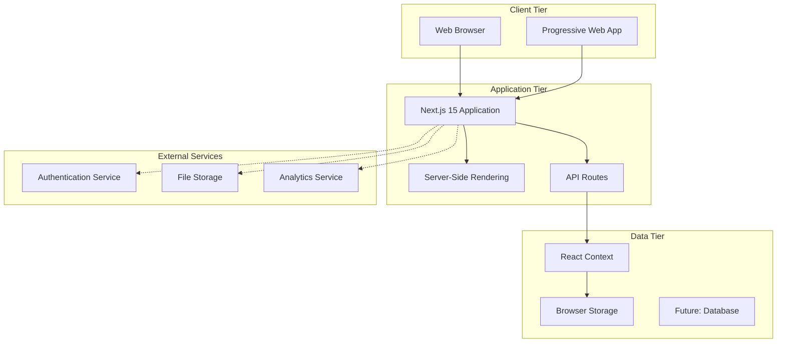

# Technical Specification Document

## Sebenza Logistics Suite - Technical Implementation Guide

---

### **Document Information**
- **Version**: 1.0
- **Last Updated**: July 3, 2025
- **Author**: Technical Lead
- **Status**: Draft

---

## **1. System Architecture**

### **1.1 High-Level Architecture**



### **1.2 Component Architecture**

The application follows a modular component architecture with clear separation of concerns:

- **Pages**: Route-based components using Next.js App Router
- **Components**: Reusable UI components organized by domain
- **Contexts**: Global state management using React Context
- **Hooks**: Custom hooks for business logic and data access
- **Utilities**: Helper functions and shared logic

---

## **2. Technology Stack Details**

### **2.1 Frontend Framework**

| Technology | Version | Purpose | Justification |
|------------|---------|---------|---------------|
| Next.js | 15.3.3 | Full-stack React framework | SSR, routing, optimization, production-ready |
| React | 18.3.1 | UI library | Component-based architecture, large ecosystem |
| TypeScript | 5.x | Type safety | Development productivity, error prevention |
| Tailwind CSS | 3.4.1 | Styling framework | Utility-first, consistent design system |

### **2.2 UI Components**

| Library | Purpose | Implementation |
|---------|---------|----------------|
| Radix UI | Headless UI primitives | Accessibility, customization |
| Lucide React | Icon system | Consistent iconography |
| Recharts | Data visualization | Charts and analytics |
| React Hook Form | Form management | Performance, validation |

### **2.3 Development Tools**

- **Build Tool**: Turbopack (Next.js built-in)
- **Package Manager**: npm
- **Code Quality**: ESLint, TypeScript strict mode
- **Styling**: PostCSS, Tailwind CSS
- **Development Server**: Next.js dev server with hot reload

---

## **3. Data Models & Schema**

### **3.1 Core Business Entities**

#### **Project Entity**
```typescript
interface Project {
  id: string;                    // UUID primary key
  name: string;                  // Project name (max 255 chars)
  location: string;              // Geographic location
  description: string;           // Project description
  status: ProjectStatus;         // 'Active' | 'On Hold' | 'Completed'
  progress: number;              // 0-100 percentage
  endDate: string;              // ISO date string
  createdAt?: string;           // Timestamp
  updatedAt?: string;           // Timestamp
}
```

#### **Task Entity**
```typescript
interface Task {
  id: string;                    // UUID primary key
  projectId: string;             // Foreign key to Project
  name: string;                  // Task name
  status: TaskStatus;            // Task completion status
  assignee: string;              // Employee name/ID
  dueDate: string;              // ISO date string
  description?: string;          // Optional task description
  priority?: TaskPriority;       // 'Low' | 'Medium' | 'High'
  createdAt?: string;           // Timestamp
  updatedAt?: string;           // Timestamp
}
```

#### **Invoice Entity**
```typescript
interface Invoice {
  id: string;                    // Auto-generated INV-XXX format
  client: string;                // Client name/ID
  amount: number;                // Subtotal amount
  tax?: number;                  // Tax amount
  discount?: number;             // Discount amount
  lateFee?: number;              // Late fee amount
  paidAmount?: number;           // Amount paid so far
  notes?: string;                // Invoice notes
  termsAndConditions?: string;   // T&C text
  signature?: string;            // Digital signature
  status: InvoiceStatus;         // 'Paid' | 'Pending' | 'Partial'
  date: string;                  // Invoice date
  projectId?: string;            // Optional project association
  type: InvoiceType;             // 'Standard' | 'Retainer' | 'Pro-forma'
  createdAt?: string;           // Timestamp
  updatedAt?: string;           // Timestamp
}
```

### **3.2 Data Validation Schema**

Using Zod for runtime type validation:

```typescript
import { z } from 'zod';

const ProjectSchema = z.object({
  name: z.string().min(1).max(255),
  location: z.string().min(1),
  description: z.string().min(1),
  status: z.enum(['Active', 'On Hold', 'Completed']),
  progress: z.number().min(0).max(100),
  endDate: z.string().datetime()
});

const TaskSchema = z.object({
  projectId: z.string().uuid(),
  name: z.string().min(1).max(255),
  status: z.enum(['PENDING', 'IN_PROGRESS', 'DONE', 'BLOCKED', 'SCHEDULED']),
  assignee: z.string().min(1),
  dueDate: z.string().datetime(),
  description: z.string().optional(),
  priority: z.enum(['Low', 'Medium', 'High']).optional()
});
```

---

## **4. API Design**

### **4.1 RESTful API Endpoints**

#### **Projects API**
```typescript
// GET /api/projects
// Returns: Project[]
// Query params: ?status=Active&limit=10&offset=0

// POST /api/projects
// Body: CreateProjectRequest
// Returns: Project

// GET /api/projects/:id
// Returns: Project

// PUT /api/projects/:id
// Body: UpdateProjectRequest
// Returns: Project

// DELETE /api/projects/:id
// Returns: { success: boolean }
```

#### **Tasks API**
```typescript
// GET /api/projects/:projectId/tasks
// Returns: Task[]

// POST /api/projects/:projectId/tasks
// Body: CreateTaskRequest
// Returns: Task

// PUT /api/tasks/:id
// Body: UpdateTaskRequest
// Returns: Task

// DELETE /api/tasks/:id
// Returns: { success: boolean }
```

### **4.2 Error Handling**

Standardized error response format:

```typescript
interface ApiError {
  error: {
    code: string;           // Error code (e.g., 'VALIDATION_ERROR')
    message: string;        // Human-readable message
    details?: any;          // Additional error details
    timestamp: string;      // ISO timestamp
    path: string;          // API endpoint path
  }
}
```

HTTP Status Codes:
- `200` - Success
- `201` - Created
- `400` - Bad Request (validation errors)
- `401` - Unauthorized
- `403` - Forbidden
- `404` - Not Found
- `409` - Conflict
- `500` - Internal Server Error

---

## **5. State Management**

### **5.1 React Context Architecture**

```typescript
// AuthContext - User authentication state
interface AuthContextType {
  user: User | null;
  company: Company | null;
  login: (email: string, password: string) => Promise<boolean>;
  logout: () => void;
  updateUser: (data: Partial<User>) => void;
  loading: boolean;
  error: string | null;
}

// DataContext - Application data state
interface DataContextType {
  // Projects
  projects: Project[];
  addProject: (project: Omit<Project, 'id'>) => void;
  updateProject: (project: Project) => void;
  deleteProject: (id: string) => void;
  
  // Tasks
  tasks: Task[];
  getTasksByProjectId: (projectId: string) => Task[];
  addTask: (task: Omit<Task, 'id'>) => void;
  updateTask: (task: Task) => void;
  deleteTask: (id: string) => void;
  
  // Loading states
  loading: {
    projects: boolean;
    tasks: boolean;
    invoices: boolean;
  };
  
  // Error states
  errors: {
    projects: string | null;
    tasks: string | null;
    invoices: string | null;
  };
}
```

### **5.2 Data Flow Pattern**

1. **Component** triggers action (e.g., create project)
2. **Context method** validates input data
3. **API call** (future) or local state update
4. **State update** triggers re-render
5. **UI updates** reflect new state

---

## **6. Security Implementation**

### **6.1 Authentication Strategy**

Current (Mock):
```typescript
// Simple credential validation
const authenticate = (email: string, password: string): boolean => {
  return email === 'admin@sebenza.com' && password === 'password';
};
```

Future (Production):
```typescript
// JWT-based authentication
interface AuthRequest {
  email: string;
  password: string;
}

interface AuthResponse {
  token: string;           // JWT access token
  refreshToken: string;    // Refresh token
  user: User;             // User profile
  expiresAt: string;      // Token expiration
}
```

### **6.2 Authorization Model**

Role-based access control:

```typescript
enum UserRole {
  ADMIN = 'admin',
  MANAGER = 'manager',
  USER = 'user',
  VIEWER = 'viewer'
}

interface Permission {
  resource: string;        // e.g., 'projects', 'invoices'
  action: string;         // e.g., 'create', 'read', 'update', 'delete'
  conditions?: any;       // Optional conditions
}

const rolePermissions: Record<UserRole, Permission[]> = {
  [UserRole.ADMIN]: [
    { resource: '*', action: '*' }  // Full access
  ],
  [UserRole.MANAGER]: [
    { resource: 'projects', action: '*' },
    { resource: 'tasks', action: '*' },
    { resource: 'invoices', action: 'read' }
  ],
  [UserRole.USER]: [
    { resource: 'projects', action: 'read' },
    { resource: 'tasks', action: '*', conditions: { assignee: 'self' } }
  ]
};
```

---

## **7. Performance Optimization**

### **7.1 Frontend Optimizations**

1. **Code Splitting**
   ```typescript
   // Dynamic imports for route-based splitting
   const ProjectsPage = dynamic(() => import('./projects/page'), {
     loading: () => <LoadingSpinner />
   });
   ```

2. **Memoization**
   ```typescript
   // Expensive calculations
   const projectMetrics = useMemo(() => {
     return calculateProjectMetrics(projects, tasks);
   }, [projects, tasks]);
   
   // Component memoization
   const TaskItem = memo(({ task, onUpdate }) => {
     // Component implementation
   });
   ```

3. **Virtual Scrolling**
   ```typescript
   // For large data sets
   import { FixedSizeList as List } from 'react-window';
   
   const VirtualizedTable = ({ items }) => (
     <List
       height={600}
       itemCount={items.length}
       itemSize={50}
       itemData={items}
     >
       {Row}
     </List>
   );
   ```

### **7.2 Bundle Optimization**

```javascript
// next.config.js
module.exports = {
  experimental: {
    turbo: {
      rules: {
        '*.svg': {
          loaders: ['@svgr/webpack'],
          as: '*.js'
        }
      }
    }
  },
  compiler: {
    removeConsole: process.env.NODE_ENV === 'production'
  },
  images: {
    formats: ['image/webp', 'image/avif']
  }
};
```

---

## **8. Testing Strategy**

### **8.1 Testing Pyramid**

1. **Unit Tests** (70%)
   - Component logic
   - Utility functions
   - Context providers
   - Custom hooks

2. **Integration Tests** (20%)
   - API endpoints
   - Component interactions
   - Data flow

3. **End-to-End Tests** (10%)
   - Critical user journeys
   - Authentication flows
   - Core business processes

### **8.2 Testing Tools**

- **Jest**: Unit testing framework
- **React Testing Library**: Component testing
- **MSW (Mock Service Worker)**: API mocking
- **Playwright**: E2E testing

---

## **9. Deployment & DevOps**

### **9.1 Build Process**

```bash
# Development
npm run dev          # Start development server

# Production build
npm run build        # Create optimized production build
npm run start        # Start production server

# Quality checks
npm run lint         # ESLint code analysis
npm run typecheck    # TypeScript type checking
npm run test         # Run test suite
```

### **9.2 Environment Configuration**

```typescript
// Environment variables
interface EnvConfig {
  NODE_ENV: 'development' | 'production' | 'test';
  DATABASE_URL?: string;
  JWT_SECRET?: string;
  API_BASE_URL: string;
  UPLOAD_SERVICE_URL?: string;
}

// Runtime config
const config = {
  apiUrl: process.env.API_BASE_URL || 'http://localhost:3001/api',
  isDevelopment: process.env.NODE_ENV === 'development',
  isProduction: process.env.NODE_ENV === 'production'
};
```

---

## **10. Monitoring & Observability**

### **10.1 Error Tracking**

```typescript
// Error boundary for React components
class ErrorBoundary extends Component<Props, State> {
  static getDerivedStateFromError(error: Error): State {
    return { hasError: true, error };
  }

  componentDidCatch(error: Error, errorInfo: ErrorInfo) {
    // Log to monitoring service
    console.error('Component error:', error, errorInfo);
  }

  render() {
    if (this.state.hasError) {
      return <ErrorFallback error={this.state.error} />;
    }
    return this.props.children;
  }
}
```

### **10.2 Performance Monitoring**

```typescript
// Performance metrics
const trackPageLoad = (pageName: string) => {
  const startTime = performance.now();
  
  return () => {
    const endTime = performance.now();
    const loadTime = endTime - startTime;
    
    // Track metrics
    analytics.track('page_load', {
      page: pageName,
      loadTime: loadTime,
      timestamp: new Date().toISOString()
    });
  };
};
```

---

## **11. Migration Strategy**

### **11.1 Data Migration**

When transitioning from mock data to real database:

1. **Export current mock data structure**
2. **Create database schema matching TypeScript interfaces**
3. **Implement data transformation scripts**
4. **Gradual migration with feature flags**

### **11.2 API Migration**

```typescript
// Feature flag for API transition
const useRealAPI = process.env.NEXT_PUBLIC_USE_REAL_API === 'true';

const dataProvider = useRealAPI ? realApiProvider : mockDataProvider;
```

---

**This technical specification serves as the foundation for implementation and should be updated as the system evolves.**
